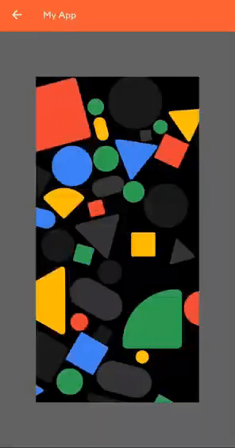

ZoomableImageBox
===============

[](https://opensource.org/licenses/Apache-2.0) [](http://developer.android.com/index.html) [](https://android-arsenal.com/api?level=21) [](https://jitpack.io/#lukelorusso/ZoomableImageBox) [](https://developer.android.com/jetpack/compose)

## Presentation ##

This is the source code of an Android Composable: `-=:[ ZoomableImageBox ]:=-`

📃 This Composable is inspired by [this solution](https://stackoverflow.com/a/67234570): it has been improved to be more generic and customizable.

- - -

## Why would you need it? ##

*"How do you make a Composable Image interactive, adding zoom and rotation features?"*  

**Introducing a Composable Box which allows you to render an Image which can be zoomed in/out and rotated.**

What you got:
- chose your modifiers
- possibility to add and customize a reset button
- rotation can be enabled or disabled as needed
- fully developed with Jetpack Compose
- easy as declaring a Composable Box
- and much more!




- - -

## How to use it? ##

Step 0. be sure that your Android project is ready for  [**Jetpack Compose**](https://developer.android.com/jetpack/compose/interop/adding)

##### DISCLAIMER #####

This code is licensed under the __Apache License Version 2.0__, _which means that_ you can freely use, modify, distribute and sell this code without worrying about the use of software: personal, internal or commercial.

**Just remember to keep the JavaDoc which contains the Copyright mention** (the part which starts with `/**` and ends with `*/` for instance)

Step 1. add the JitPack repository to your ROOT build.gradle at the end of repositories:

```groovy
allprojects {
    repositories {
        // among other things
        maven { url 'https://jitpack.io' }
    }
}
```

Step 2. add the dependency:

```groovy
    implementation 'com.github.lukelorusso:ZoomableImageBox:1.0.2'
```

Step 3. use it in your Composable content:

```kotlin
    val painter = painterResource(id = R.drawable.your_wonderful_image_id)
    ZoomableImageBox(
        painter = painter // you may want to use a bitmap instead!
    )
```  

...eventually adding more useful parameters:

```kotlin
    ZoomableImageBox(
        modifier = Modifier
            .fillMaxSize()
            .background(MaterialTheme.colors.background),
        contentAlignment = Alignment.BottomEnd,
        contentDescription = "My image description",
        bitmap = myBitmap,
        imageContentScale = ContentScale.Inside,
        shouldRotate = true,
        showResetIconButton = true,
        initialGestureData = GestureData(angle, zoom, offsetX, offsetY),
        onGestureDataChanged = { gestureData -> },
        resetIconButtonModifier = Modifier
            .padding(8.dp)
            .background(MaterialTheme.colors.surface, shape = CircleShape),
        resetIconButtonContent = {
            Icon(
                imageVector = Icons.Default.Refresh,
                contentDescription = "Reset icon description",
                tint = MaterialTheme.colors.primary
            )
        }   
    )
```  

That's it!

- - -

# Customization #

For a complete list of the possible customizations, please refer to the JavaDoc of the **ZoomableImageBox.kt** file! 😉
It's all up to you!

- - -

# Explore! #

Feel free to check out and launch the example app 🎡

Also, see where using this code has been the perfect choice:

[](https://play.google.com/store/apps/details?id=com.lukelorusso.colorblindclick)  
[**ColorBlindClick**](https://play.google.com/store/apps/details?id=com.lukelorusso.colorblindclick)

[](https://play.google.com/store/apps/details?id=com.swissquote.android)  
[**Swissquote Trading**](https://play.google.com/store/apps/details?id=com.swissquote.android)

- - -

# Copyright #

Make with 💚 by [Luca Lorusso](http://lukelorusso.com), licensed under [Apache License 2.0](http://www.apache.org/licenses/LICENSE-2.0)
